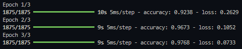
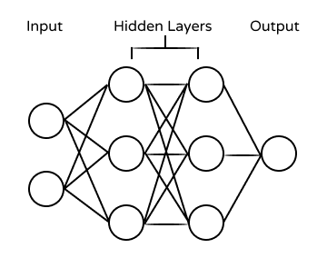

# Neural Networks 

### Collection of Neural Networks Developed using Tensor Flow 
Simple application built using Python experimenting with different Neural Networks

#### Dependencies
- Tensor Flow
- Numpy
- Panda

#### Models
- Sentiment Analysis Model
- Convolution Neural Network
- Digit Identification Model

#### Neural Network Accuracies

#### Diagram

